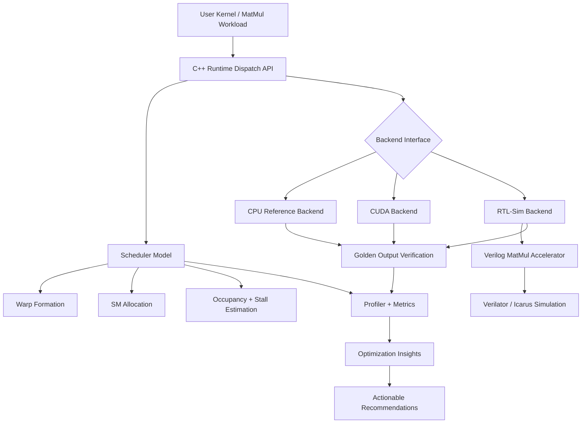
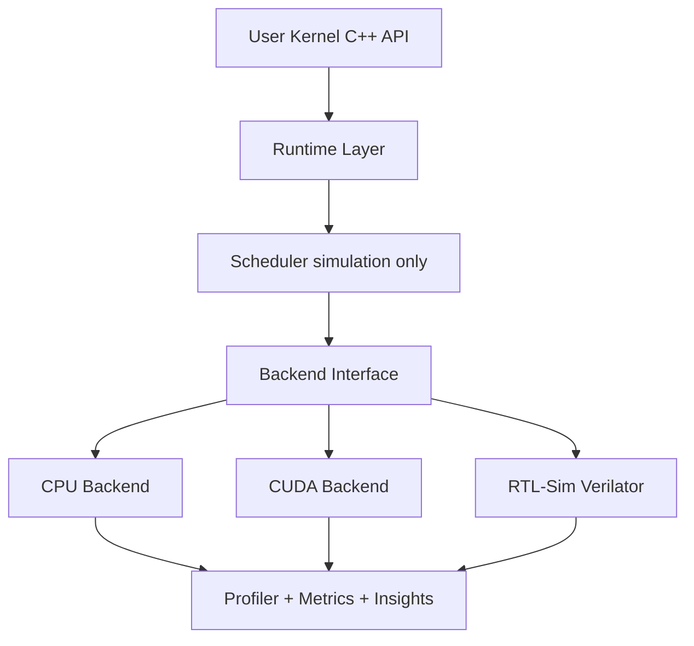

# OpenGPU Lab


## Quick Start
```bash
git clone https://github.com/tejakusireddy/opengpu-lab
cd opengpu-lab
make analyze KERNEL=backends/cuda/kernels/matmul.cu
```

```bash
make analyze KERNEL=your_kernel.cu   # analyze any CUDA file
make fix KERNEL=your_kernel.cu       # detect + auto-fix
make benchmark                        # CPU vs CUDA vs RTL performance
```

> Run the same workload on CPU, CUDA, and RTL — then see exactly where your GPU performance is being wasted.

OpenGPU Lab is an open-source GPU systems lab for understanding and optimizing how workloads move from software runtime to hardware execution.

It provides one C++ dispatch API with multiple execution backends:

- CPU reference backend
- CUDA backend
- RTL simulation backend via Verilator
- Warp/block scheduler model
- Golden-output verification
- Profiler with optimization insights

The goal is simple: run the same workload across CPU, CUDA, and RTL-sim, compare correctness and performance, then explain where GPU execution is wasting time.

**Fully open-source (MIT License). Built for learning, experimentation, and real GPU performance analysis.**

## gpuopt — CLI Tool

`gpuopt` analyzes a CUDA kernel file end-to-end and reports memory access issues, roofline classification, and optimization guidance in one command.

```bash
cmake -S opengpu-lab -B opengpu-lab/build
cmake --build opengpu-lab/build
cd opengpu-lab
```

Command 1:
```bash
./build/tools/gpuopt --kernel backends/cuda/kernels/matmul.cu --n 64
```
```text
gpuopt — GPU Kernel Optimizer
==============================
Analyzing: backends/cuda/kernels/matmul.cu  (n=64)

=== Memory Access Analysis ===
[✓] a_device -> COALESCED (stride=1)
[!] b_device -> STRIDED (stride=64) — non-coalesced column access
[✓] c -> COALESCED (stride=1)

=== Roofline Analysis ===
Arithmetic Intensity : 10.67 FLOPS/byte
Ridge Point          : 11.11 FLOPS/byte
Classification       : MEMORY BOUND

=== Optimization Insights ===
[!] STRIDED access detected on b_device
    -> Apply shared memory staging to fix
    -> Run with --fix to auto-apply

=== Summary ===
Issues found : 1
Auto-fixable : 1
Run with --fix to apply all fixes
```

Command 2:
```bash
./build/tools/gpuopt --kernel backends/cuda/kernels/matmul.cu --n 64 --fix
```
```text
gpuopt — GPU Kernel Optimizer
==============================
Analyzing: backends/cuda/kernels/matmul.cu  (n=64)

=== Memory Access Analysis ===
[✓] a_device -> COALESCED (stride=1)
[!] b_device -> STRIDED (stride=64) — non-coalesced column access
[✓] c -> COALESCED (stride=1)

=== Roofline Analysis ===
Arithmetic Intensity : 10.67 FLOPS/byte
Ridge Point          : 11.11 FLOPS/byte
Classification       : MEMORY BOUND

=== Optimization Insights ===
[!] STRIDED access detected on b_device
    -> Apply shared memory staging to fix
    -> Run with --fix to auto-apply

=== Summary ===
Issues found : 1
Auto-fixable : 1
Run with --fix to apply all fixes

=== Auto-Fix Applied ===
[✓] b_device: STRIDED -> COALESCED via shared memory staging
[✓] New arithmetic intensity: 16.00 FLOPS/byte
[✓] Classification: COMPUTE BOUND (was MEMORY BOUND)
```

Passing `--fix` applies the shared-memory staging optimization automatically and reruns the classification with the updated arithmetic intensity.

## Table of contents

- [gpuopt — CLI Tool](#gpuopt--cli-tool)
- [Quick start](#quick-start)
- [Prerequisites](#prerequisites)
- [Install (one-time)](#install-one-time)
- [How it works](#how-it-works)
- [Why this exists](#why-this-exists)
- [Who this is for](#who-this-is-for)
- [Run this now](#run-this-now)
- [What you get (real run output)](#what-you-get-real-run-output)
- [Zero-diff correctness proof](#zero-diff-correctness-proof)
- [Architecture](#architecture)
- [Build and run](#build-and-run)
- [Scheduler simulation output](#scheduler-simulation-output)
- [RTL accelerator](#rtl-accelerator)
- [Project layout](#project-layout)
- [What this is / what this is not](#what-this-is--what-this-is-not)
- [Roadmap](#roadmap)

## Quick start

```bash
cmake -S opengpu-lab -B opengpu-lab/build && cmake --build opengpu-lab/build && ctest --test-dir opengpu-lab/build -V
```

> Works without CUDA (CPU/RTL only). The CUDA backend has a host fallback when CUDA is unavailable.

## Prerequisites

- C++17 toolchain (gcc/clang)
- CMake ≥ 3.20
- CUDA toolkit (for CUDA backend)
- Icarus Verilog / Verilator (for RTL-sim)

## Install (one-time)

```bash
git clone <repo>
cd opengpu-lab
cmake -S . -B build && cmake --build build
```

## How it works



## Why this exists

Most GPU tools tell you what happened.

OpenGPU Lab tells you:
- why it happened
- where performance is lost
- what to change

This bridges the gap between CUDA usage and GPU system understanding.

## Who this is for

- Engineers learning GPU systems internals
- Developers optimizing CUDA workloads
- Students studying parallel computing
- Systems engineers exploring runtime ↔ hardware interaction

## Run this now

From repo root:

```bash
cmake -S opengpu-lab -B opengpu-lab/build
cmake --build opengpu-lab/build
cd opengpu-lab/build
ctest -V
```

For RTL-only simulation:

```bash
cd opengpu-lab
iverilog -o rtl/sim/tb_matmul rtl/tb_matmul.v rtl/matmul_accelerator.v
vvp rtl/sim/tb_matmul
```

## What you get (real run output)

Real output from `ctest -V` (`test_profiler` section):

```text
=== Performance Report ===
Backend     Latency(ms)   Throughput(ops/s)     Occupancy   Stall
cpu         1.026         511230159.272         0.016       0.005
cuda        1.011         518711847.638         0.016       0.005
rtl_sim     73.205        7161943.737           0.016       0.005
=== Optimization Insights ===
[!] low_occupancy detected on backend 'cpu' (occupancy=0.02)
    -> Increase threads per block or batch size
[!] memory not coalesced on backend 'cpu'
    -> Potential 20-30% performance loss
[!] low_occupancy detected on backend 'cuda' (occupancy=0.02)
    -> Increase threads per block or batch size
[!] memory not coalesced on backend 'cuda'
    -> Potential 20-30% performance loss
[!] low_occupancy detected on backend 'rtl_sim' (occupancy=0.02)
    -> Increase threads per block or batch size
[!] memory not coalesced on backend 'rtl_sim'
    -> Potential 20-30% performance loss
[!] backend 'rtl_sim' latency is high (latency_ms=73.205)
    -> Consider kernel fusion or batching
[!] CUDA underutilization detected (speedup=1.015x)
```

## Compiler Auto-Fix

```text
=== Fixed Matmul IR (auto_coalescing_fix_pass) ===
  op=LOAD dst=a_reg src0=a src1= tile_size=0
  op=LOAD dst=b_reg src0=b src1= tile_size=0
  op=TILE dst=tile src0= src1= tile_size=64
  op=MUL dst=tmp src0=a_reg src1=b_reg tile_size=0
  op=ADD dst=c src0=c src1=tmp tile_size=0
  op=STORE dst=c src0=c src1= tile_size=0
[✓] Auto-fix rewrote tile_size 48 -> 64
[✓] Coalescing check after fix: PASS
```

This proves the compiler detects a non-coalesced tile size and automatically rewrites it to the nearest valid multiple of 32. It then verifies the fix with a coalescing pass, requiring no user intervention.

## Zero-diff correctness proof

Real output from the test suite:

```text
n=4 CPU vs CUDA max abs diff: 0.000000
n=64 CPU vs CUDA max abs diff: 0.000000
Dispatcher cpu vs cuda max abs diff: 0.000000
```

And CPU vs RTL-sim element-by-element:

```text
idx=0 rtl=80.000000 cpu=80.000000 diff=0.000000
idx=1 rtl=70.000000 cpu=70.000000 diff=0.000000
idx=2 rtl=60.000000 cpu=60.000000 diff=0.000000
idx=3 rtl=50.000000 cpu=50.000000 diff=0.000000
idx=4 rtl=240.000000 cpu=240.000000 diff=0.000000
idx=5 rtl=214.000000 cpu=214.000000 diff=0.000000
idx=6 rtl=188.000000 cpu=188.000000 diff=0.000000
idx=7 rtl=162.000000 cpu=162.000000 diff=0.000000
idx=8 rtl=400.000000 cpu=400.000000 diff=0.000000
idx=9 rtl=358.000000 cpu=358.000000 diff=0.000000
idx=10 rtl=316.000000 cpu=316.000000 diff=0.000000
idx=11 rtl=274.000000 cpu=274.000000 diff=0.000000
idx=12 rtl=560.000000 cpu=560.000000 diff=0.000000
idx=13 rtl=502.000000 cpu=502.000000 diff=0.000000
idx=14 rtl=444.000000 cpu=444.000000 diff=0.000000
idx=15 rtl=386.000000 cpu=386.000000 diff=0.000000
max diff: 0.000000
```

## Architecture



## Build and run

From repo root:

```bash
cmake -S opengpu-lab -B opengpu-lab/build
cmake --build opengpu-lab/build
cd opengpu-lab/build
ctest -V
```

## Scheduler simulation output

Real output from `test_scheduler`:

```text
=== Scenario A -- Healthy Launch ===
total_threads   : 2048
total_warps     : 64
occupancy       : 0.500000
stall_fraction  : 0.150000
warp_utilization: 1.000000
memory_coalesced: true
low_occupancy   : false
high_stall      : false

=== Scenario B -- Bad Launch ===
total_threads   : 48
total_warps     : 2
occupancy       : 0.015625
stall_fraction  : 0.004688
warp_utilization: 1.000000
memory_coalesced: false
low_occupancy   : true
high_stall      : false
```

## RTL accelerator

The Verilog block is an FSM-based matrix multiply accelerator (`IDLE`, `COMPUTE`, `DONE`) with explicit reset, computing one output element per cycle.

Run:

```bash
cd opengpu-lab
iverilog -o rtl/sim/tb_matmul rtl/tb_matmul.v rtl/matmul_accelerator.v
vvp rtl/sim/tb_matmul
```

Real `vvp` output:

```text
c_flat[0] = 80
c_flat[1] = 70
c_flat[2] = 60
c_flat[3] = 50
c_flat[4] = 240
c_flat[5] = 214
c_flat[6] = 188
c_flat[7] = 162
c_flat[8] = 400
c_flat[9] = 358
c_flat[10] = 316
c_flat[11] = 274
c_flat[12] = 560
c_flat[13] = 502
c_flat[14] = 444
c_flat[15] = 386
opengpu-lab/rtl/tb_matmul.v:89: $finish called at 205 (1s)
```

## RTL Validation

```text
[✓] Reset clears output: PASS
[✓] Done asserted on cycle 17 (bound=66): PASS
```

These checks prove the FSM correctly zeroes output when reset is asserted at the signal level. They also prove `done` fires within the expected clock-cycle bound for a 4x4 matrix.

## Project layout

```text
opengpu-lab/
  runtime/
  backends/
    cpu/
    cuda/
    rtl_sim/
  compiler/
  scheduler/
  rtl/
  verilator/
  profiler/
  tools/
    gpuopt
  tests/
```

## What this is / what this is not

This is a systems execution stack: runtime dispatch, backend parity, scheduler modeling, RTL simulation, and optimization insights in one place.

This is not a hello-world CUDA sample, not a standalone Verilog demo, and not a benchmark chart with no correctness story.

## Roadmap

- Auto-tuning (batch size, block size)
- Kernel fusion recommendations
- ROCm backend (AMD GPU support)
- Web interface for browser-based analysis
- ML-based optimization model
